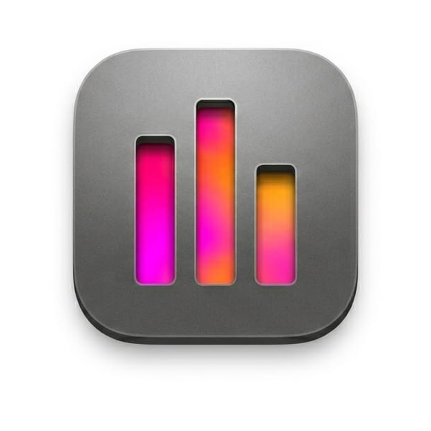

<p align="center">
  
</p>

<h1 align="center">BeatFlare</h1>

<p align="center">
  A live music visualizer for <strong>Nothing Phones</strong> that drives the glyph LEDs from microphone audio.<br>
  Designed for concerts and festivals -- hold your phone face-down and watch the back light up in sync with the music.
</p>

---

## What it does

BeatFlare captures live ambient audio, runs real-time FFT analysis, and maps the frequency spectrum onto the glyph LEDs. Depending on your device, LEDs are split into zones for spectrum visualization, bass VU metering, and beat detection flashes.

The visualizer runs as a foreground service, so it keeps working when the screen is off -- ideal for saving battery at a festival while your phone's back pulses to the music.

### Features

- **Microphone-based** -- captures live ambient audio, not just on-device playback
- **Adaptive normalization** -- automatically adjusts from quiet room to festival stage
- **Per-LED brightness control** -- 12-bit (0-4095) per LED via the Glyph SDK
- **Foreground service** -- survives screen lock and app backgrounding
- **Brightness slider** -- adjust overall LED intensity
- **Zone toggles** -- enable/disable spectrum, bass, and beat zones independently
- **Party mode** -- full-screen front-of-phone color visualization synced to audio
- **Notification control** -- start/stop from the persistent notification

## Supported Devices

| Device | LEDs | Glyph visualization | Party mode |
|---|---|---|---|
| Nothing Phone (1) | 15 | Yes | Yes |
| Nothing Phone (2) | 33 | Yes | Yes |
| Nothing Phone (2a) | 26 | Yes | Yes |
| Nothing Phone (2a) Plus | 26 | Yes | Yes |
| Nothing Phone (3a) / (3a) Pro | 36 | Yes | Yes |
| Nothing Phone (4a) | 6 | Yes | Yes |
| Any Android 14+ device | -- | No | Yes |

## Getting Started

### Requirements

- Android 14+ (API 34+)
- For glyph visualization: a Nothing Phone with glyph debug mode enabled:
  ```bash
  adb shell settings put global nt_glyph_interface_debug_enable 1
  ```
  *(expires after 48 hours, re-run as needed)*

### Building

```bash
./gradlew :app:assembleDebug
adb install -r app/build/outputs/apk/debug/app-debug.apk
```

## Support

If you enjoy BeatFlare and want to support its development:

[](https://ko-fi.com/stilkin)

## License

[PolyForm Noncommercial 1.0.0](LICENSE) -- free for personal and non-commercial use.
